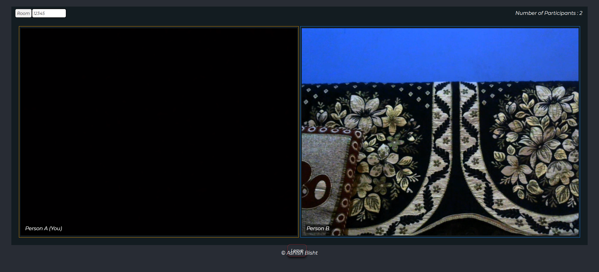

# WebRTC Group Video Chat Web App
 
 

## WebRTC
[Web Real-Time Communication(WebRTC)](https://developer.mozilla.org/en-US/docs/Web/API/WebRTC_API) is a technology that enables real time media communications like voice, video and data transfer natively between without any third party software.

Peer connection is the core of the WebRTC. It provides a way for clients to create direct connections with their peers without the need for an intermediary server.
Each client takes the media acquired from the media stream API and plugs it into the peer connection to create an audio or video feed.  
 
 
This Project is based on the WebRTC framework works by setting the peer connections between the users.
Each client(peer) acts as a server and client, so it becomes challenging for the client's browser to handle the peer connections as the number of clients increase.
Therefore the max limit of client connections should be up to 4 for getting a fair connection.
 
Project hosted on [https://web-video-chat-app.herokuapp.com/](https://web-video-chat-app.herokuapp.com/)

  Reference :
* [MDN WebRTC API](https://developer.mozilla.org/en-US/docs/Web/API/WebRTC_API)
* [WebRTC Guide](https://www.frozenmountain.com/ultimate-guide-to-webrtc)

  

 
 

## Project Tech
* WebRTC
* ReactJS
* Node.js
* Socket. io
* Npm
  
  

 ## Demo 

 
 

 
 

 
 

